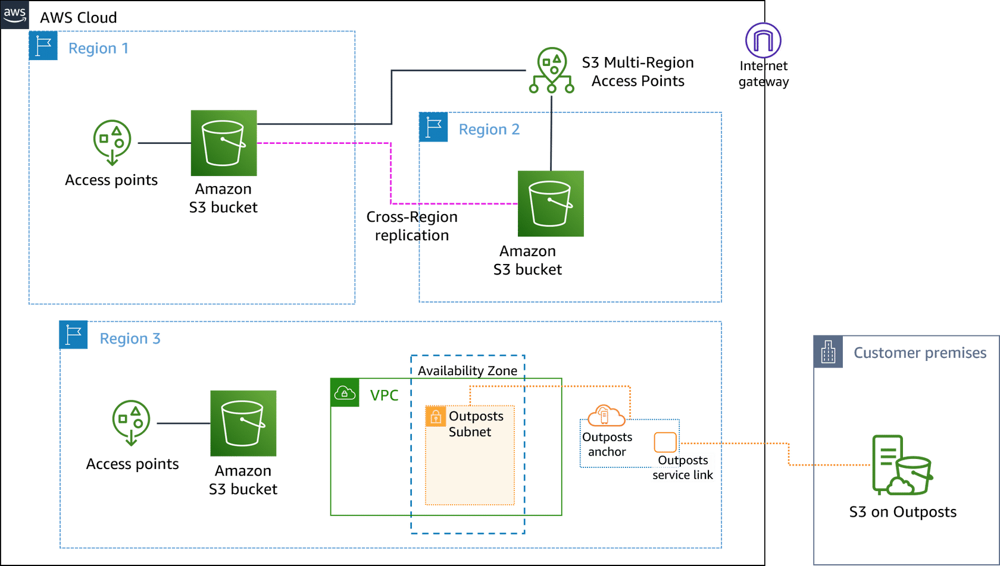
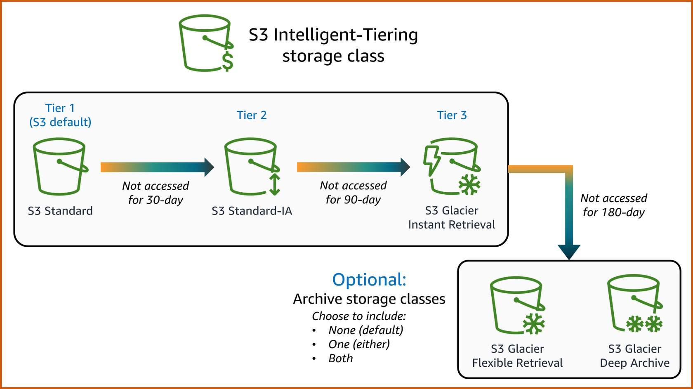

# Amazon S3

## Primary Storage Types

### Block Storage

- Basic fixed storage units in the device

### Object Storage (AWS S3)

- Built on top of Block Storage
- Created with an operating system that formats and manages read/write of the Block Storage
- Does not differentiate between types of data
- Made up of a large number of Storage Blocks, using a predetermined object size

### File Storage

- Built on top of Block Storage
- Usually serves as a file share or file server
- Created with an operating system that formats and manages read/write of the Block Storage
- Stores data as files tipically in a directory-tree hierarchy

## About S3

- Data is stored as objects into buckets
- An object is composed by a file and optionally metadata that describes the file
- While uploading a file to S3, it is possbile to define permissions and any metadata to the file
- Buckets store objects. It is possible to control access to them, get access logs and chose the region where it will be stored
- An object can have up to 5 terabytes in size
- All objects inside a bucket are organized in a flat way. You can use prefixes to organize, but it will not add any hierarchy

## Analytics

### Storage Management

S3 Batch Operations can do the following:

- Copy objects between buckets
- Replace objects tag sets
- Modify access controls
- Restore archived objects from Amazon S3 Glacier

### Version control

- Prevents accidental deletion
- Provides preservation, retrieve, and restore of every version

### Replication

- Possible to replicate objects and their metadata into other buckets in the same or different AWS regions
- **S3 Cross-Region Replication**
- **S3 Same-Region Replication**

### Retention and compliance

- **S3 Object Lock** lets you block an object version from deletion
- Write once, read many (WORM) compliance possibility - Data cannot be changed or deleted after written

### Monitoring

- **AWS Cost Allocation Reports** can be used to monitor usage and costs per tag
- **Amazon CloudWatch** can be configured to send billing alerts and track health
- **AWS CloudTrail** montior and report bucket and object level activities
- **S3 Event Notifications** can be used to trigger workflows, alerts, and invoke Lambda when some change is made to S3. It can:
  - Transcode media files as they are uploaded
  - Process data files as they become available
  - Sync objects with other data stores
- **S3 Storage Lens** provides insights on object usage and trends, and also recommendations to optimize the storage
- **S3 Storage Class Analysis** analyzes access patterns to help transition less frequent accessed data to lower-cost storaging

## Access Management & Security

### Access Management

- By default, users only have access to resources they create
- **S3 Block Public Access** blocks public access to buckets and objects by default
- **Access Analyzer for Amazon S3** monitors bucket access policies
- **Amazon Macie** can discover and protect any sensitive data in S3. It can use ML to detect any sensitive data, like PII and alert you. It can provide alerts on:
  - Public accessible bucket
  - Unencrypted bucket
  - Buckets shared or replicated with accounts out of your organization
- Access can be granted by an admin via:
  - **IAM** create users and manage their permissions
  - **Access control** lists make inividual objects accessible by authorized users
  - **Bucket policies** configure permissions for all objects inside a bucket
  - **S3 Access Points** with names and permissions specific to each application or sets of applications
  - **Query String Authentication** grants time-limited access with temporary URLs

### On-premises connectivity

- **Amazon Virtual Private Cloud (VPC)** can be used to connect on-premises environment with Amazon S3
- **AWS PrivateLink** provides private connectivity between S3 and on-premises environment

### Encryption

- By default, all objects are encrypted with Amazon S3 managed keys (SSE-S3) or AWS Key Management Service (AWS KMS) keys stored in AWS KMS (SSE-KMS)

## Data processing

### S3 Object Lambda

- Uses Lambda functions to process the output of S3 before sending to the consumer

### S3 Select

- Increases performance by smartly querying a subset of an object, instead of the entire object when retrieving data

## Pricing

AWS S3 has 6 pricing components:

- Storage pricing
- Request and data retrieval pricing
- Data transfer and acceleration pricing
- Data management and analytics pricing
- S3 Object Lambda processing pricing
- S3 Region pricing

## ARCHITECTURE

- S3 is a regional service. When creating a bucket you specify the Region. S3 utilizes the Availability Zones in that region to host the bucket
- Access Points in the Region of the bucket allow you to create multiple logical points of entry to the Bucket.
- Access Points can be used to specify a prefix level a user can access
- Multi-Region Access Points can grant access to multiple region buckets with one access point
- Each bucket has a globally unique name across AWS
- You can use cross-region replication between S3 buckets from different regions
- AWS Outposts can be configured to include S3 storage
- S3 uses REST APIs to exchange information between applications

### S3 Intelligent Tiering Storage Class

- Moves data to the most cost-efficient access tier based on access frequency

### S3 Lifecycle

- Automate transfer data to different storage class without changes to application
- Transition actions - define when objects transition from one storage class to another
- Expiration actions - define when objects expire and Amazon can delete

## STORAGE CLASSES

- S3 mantains durability by copying an object across multiple Availability Zones (AZ) within a single AWS Region
- 99.999999999% (eleven nines) of durability
- Minimum of 3 AZs in a region for one data
- Each AZ is separated by a min of 1km and max 100km to avoid natural disaster to kill all data
